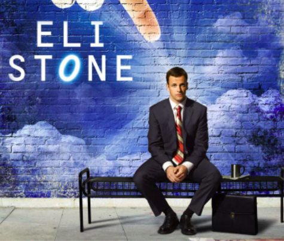

## Aqualung -Jethro

Yep, that's the search key to use if you want to look up on Google information for this incredible artist.

I want to start this new category, _"lets-take-a-break"_, where sometime I will share some of my favourite ways of taking
a break.

Most of the time is listening to some my favourite music artists. And today, I'll start
with **[Aqualung](https://music.apple.com/us/artist/aqualung/14127688)**.

He's an incredibly elegant and talented british artist. In his music, you can listen influences from the best
inspirations out there: Beatles, Tears for Fears, Radiohead, Bon Iver, and others. 

Everything mixed in a fascinating and colourful
compositions that result in an impressively curated pop, with complex harmonies that sound so easy.

#### How did I discover it?

Funny enough most of my favorite artist come from causal discoveries, often while doing something different from listen
to music.

For Aqualung, it was a long time ago, while watching a very nice tv show, [Eli Stone](https://www.imdb.com/title/tt0892535/).

In the first episode (or second, not sure anymore), Eli was considering to take an important decision over his life and
suddenly an impressively beautiful song starts: ["Something to Believe In"](https://www.youtube.com/watch?v=m3s79fqELSg)
.

I got captured by the sound, style and energy of the song, and I immediately checked IMDB for the soundtrack. Then I
bought my first Aqualung album ["Memory Man"](https://en.wikipedia.org/wiki/Memory_Man_(album)), that I recommend to 
everyone to get to know him.

From that moment on, every album is a pleasant surprise. In my favourites, I always have this live show on YouTube:

----
  
Aqualung Live at Club Cafe

----

That's it. Enjoy this _"lets-take-a-break"_ for today.