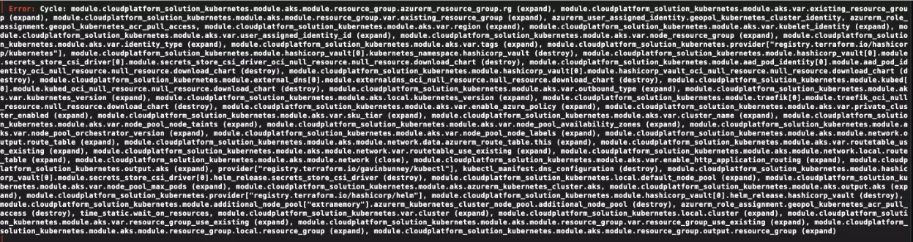

## Current state of the art

We all know, Terraform is the current de-facto standard when it comes to describe your infrastructure.

We might also have experienced some limitation in flexibility when we used Terraform (mostly the versions < 1.0) for
which we had to implement quite often some hackish workaround: thinking about conditional logic, "for-each's" when there
was no foreach support, etc...

Luckily most of these can masked via **modules**, a quite flexible representation of logical group of resources.

Now, I see there are very interesting and fascinating alternatives to Terraform, that solve most of the un-flexibility
we encountered while describing our infrastructure (read [Pulumi](https://www.pulumi.com/)) but we can discuss another
time about this topic.

The idea behind this post is to share some thoughts on the way Terraform is used, and the way I personally think it
should be used instead.

> **TL;DR** Terraform is not your silver-bullet for infrastructure. Actually is just a language to describe the infrastructure, not to orchestrate the creation of it, even if it pushes you to think is a good idea to use it also for orchestration._

## Pitfalls of big modules

Thanks to the flexibility given by modules, Terraform can compose quite complex infrastructure representations.

But after a while, you may figure out that big infrastructure representation started looking like a big monolith. Are
you sure your infrastructure is actually a big monolith?

Are you perhaps trying to use a single root module because it looks convenient to drive everything with Terraform, and
you can easily (really?) keeps all the relationships between all the resources in a single root module?

I'm quite sure at some point you will have a single root module that starts creating that complex infrastructure, then
it also (because why not, it's easy to plug it in there) deploys your application, maybe with Helm if you run
Kubernetes.

And, not least, when it comes to the normal "everyday fuck-ups" like a circular dependency introduced by mistake you
might need to figure out your acyclic graph composed by hundreds of resources... good luck with that.

## What is a layered infrastructure

Lets thing a moment about the first question above:

**Are you sure your infrastructure is actually a big monolith?**

Since before we mentioned Helm, let's assume our project is an application that runs on top of Kubernetes.

If you think about it your infrastructure is composed by group of resource that can be categorized and identified by
their own lifecycle:

1. _**Identities, roles**_, they are created once and rarely change. What usually changes in there is some credential
   associated to these identities, but the credentials should not be described as infra. They are part of the secret
   management.
2. Another group might be the _**global resources**_, used across multiple regions: think about the hosted zones. You
   plug regional workloads in your global hosted zone, but the hosted zone itself never change.
3. _**Elastic, static, IPs**_ that are there for a reason (otherwise you would use the more flexible cloud endpoints).
4. Your _**regional infrastructure**_ that usually has an underlying networking that act as a base for a subsequent
   layer of infra
5. Your _**main infrastructure**_, on top of which you will run your workload.
6. Your workload, or _**application**_

All these above might have a different lifecycle. Now we don't want to create a granularity hell, but in general we can
approach this separation with an abstraction like: **identities, base-infra, cluster-baseline, application**.

 
graph TB; 
subgraph Identities 
    identities(roles, managed identities)
end 
subgraph Base Infra 
    base_infra(DNS Zones, Networking)
end 
subgraph Cluster Baseline 
    cluster_baseline(Kubernetes Cluster, Ingress, CertManager, External DNS, Vault Integration)
end 
subgraph Application 
    application(Helm Chart - your application)
end

identities -.-|uses identities| base_infra 
base_infra -.-|requires existing networking layer| cluster_baseline
cluster_baseline -.-|requires Kubernetes coordinates| application 


- **identities**: includes all the managed identities and the custom roles
- **base-infra**: includes all the global resources and networking
- **cluster-baseline**: includes your cluster per region, maybe including the components that are granting the
  functionalities part of your baseline (thinking about ingress, certificate management, dns management, secrets
  management)
- **application**: what you actually want to run on top of your full-fledge cluster. This is your set of application

At the end of the day, if you want to go for continuous delivery, it might be that **you will deploy multiple times per
day only the application layer**, whereas the rest is deployed with different pace or barely changes at all.

You can also think about this separation by imagining different team offers different layer as their deliverable.

I like to imagine these abstractions as layers, and my personal idea is that they should be implemented with IaC in
Terraform, but not deployed in a single root module.

> This is the very moment where the convenience of Terraform stops, and we need to use something else.

## Pros of Layered Infrastructure

When you start splitting your infrastructure with the layered approach you can immediately see some benefit:

- Your **state files and code are slimmer** and more maintainable.
- It pushes you to **start thinking and reason about interfaces**. In Terraform the interfaces are the `variables.tf`
  files.
- You create a domain of concerns, another important [SOLID principle](https://en.wikipedia.org/wiki/SOLID) of software
  engineering.
- Being different layers, multiple person can work and deploy on different layers without risking incurring in state
  locking because someone else is using the same state file.
- With layering you are forced to put more attention in the breaking changes you might introduce while you are coding
  and the impact you might have on subsequent layers.

## How to Orchestrate

Now it comes the interesting part.

With this separation in mind I can't really split things in terraform. I mean, you can use different root modules for
each of these layers, but we need to find another way to orchestrate the deployment of all these stacks.

In addition, these stacks might depend on each other. So the strategy is that each subsequent stack read what he needs
from the information exported from the previous stack(s).

We can achieve this in different way depending on the orchestration technology.

Most common case is that the next layer receives the minimal necessary requirement from the orchestrator, so that it can
proceed with the deployment: just to make an example with the  **application** layer: it will require only the
coordinate of the Kubernetes cluster, and then it can proceed by instantiating the required provider and targeting the
cluster.

In this context the orchestrator, once the cluster is deployed can retrieve the information from the remote state and
pass them to the next layer.

When it comes to the orchestration technologies here some examples I've used:

### Terragrunt

**[Terragrunt](https://terragrunt.gruntwork.io/)** looks for the moment the most interesting technology to drive the
orchestration. It supports quite interesting helpers to make the dependencies explicit, and you can easily test the
deployment orchestration from your laptop.

### Pipelines

You can also describe the orchestration with pipelines or workflows, such as **GitHub actions**. In this case, there is
the
_pitfall of creating too complex actions that tie you to the specific technology for the runners_.  
For example, if you start creating complex orchestrations with GitHub actions then you will not be able to easily test
them in your local development (workstation). Some project might help you [like ACT](https://github.com/nektos/act), but
most of the time it's just faster to push the branch and let the runners deploy and test your changes.

### Taskfile

Another technology, more tech-agnostic and portable, might be the new replacement for the glorified Makefiles,
**[Taskfile](https://taskfile.dev/#/)**. It's a Golang project (single binary) that offers incredible flexibility and
rich features to drive your orchestration.

## Final Thoughts and what's next

I personally see Terragrunt as the most featured way to orchestrate even though, on the other side I dislike a bit the
way it creates complex interpolations. It might become difficult to maintain.

The other possibility I see interesting is to describe the orchestration with Taskfile, so that you can create the tasks
and be able to use them locally or on the runners.

Next article, I will showcase an example repository that follows the layered infrastructure pattern, just to try to
explain more clearly how I think a good use of layers should be like.